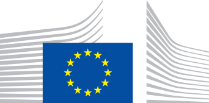
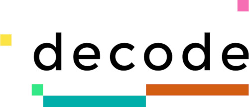

# Documentation

Zenroom is a **secure language interpreter** of both Lua and its own
[Zencode](zencode) language to execute fast cryptographic operations using
elliptic curve arithmetics.

The Zenroom VM is very small, has **no external dependency**, is fully
deterministic and ready to run **end-to-end encryption** on any platform:
desktop, embedded, mobile, cloud and even web browsers.

[Zencode](zencode) is the name of the language executed by Zenroom: it is simple
to understand and can process large data structures while operating
cryptographic transformations on them.

This website is intended for a technical audience; more documentation is
available on:

 Website: [Zenroom.org](https://zenroom.org)

 Whitepaper: [Zencode by Jaromil](https://files.dyne.org/zenroom/Zenroom_Whitepaper.pdf)

 Blog post: [Why Zenroom? Algorithmic Sovereignty](https://decodeproject.eu/blog/algorithmic-sovereignty-decode)

 Blog post: [Zenroom does what? Smart contracts for the English speaker](https://decodeproject.eu/blog/smart-contracts-english-speaker)

 Blog post: [Cryptographic data integrity in a multiplatform environment](https://decodeproject.eu/blog/cryptographic-data-integrity-multiplatform-environment)

# Download

Available targets:

- Portable source code (C99)
- **Javascript** (WebAssembly)
- **Linux** (Android, ARM and x86)
- **Windows** (EXE and DLL)
- **Apple** (OSX and iOS)

Download from [files.dyne.org/zenroom](https://files.dyne.org/zenroom)

[History of changes](changelog)

Anyone planning to use Zenroom to store and access secrets should not
use the latest development version in Git, but **use the stable
releases on files.dyne.org**.

Before releasing we make sure Zenroom works as expected by running
various tests, plus we note down all changes in the log above.

The development version in Git should only be used by contributors to
report bugs, test new features and develop patches.

# Guides

<iframe src='https://www.openhub.net/p/zenroom/widgets/project_factoids_stats' scrolling='no' marginHeight='0' marginWidth='0' style='height: 220px; width: 370px; border: none'></iframe>

Zenroom is actively and concisely documented focusing on three main usage aspects:

- How to program using its human friendly Zencode language
- How to implement new encryption scenarios using Lua scripting (similar to Mathematica)
- How to adopt the Zenroom VM embedding it into host applications (covering all platforms)

The following sections provide links to documentation for each named aspect.

## How to program

Zenroom brings simplicity to distributed systems development and
allows programmers to work in parallel. System integrators need just
to adopt the VM embedding it in their application, security
researchers and cryptographers can provide Zencode or Lua scripts.

[Zencode: programming smart contracts in human language](zencode)

[Crypto scheme implementation using Zenroom and Lua](crypto)

[Zenroom scripting in Lua: reference documentation](lua)

## How to adopt

[How to execute scripts with Zenroom](wiki/how-to-exec)

[How to embed Zenroom in your application](wiki/how-to-embed)

[How to build Zenroom from the source code](wiki/how-to-build)

# Playground

## Online

[Online interactive demo](demo)

[Web encryption demonstration and benchmark](encrypt)

## Apps

[Redroom: fast execution of Zencode in Redis](https://redroom.dyne.org)

[Sawroom: blockchain integration with Sawtooth](https://redroom.dyne.org)

## Benchmarks

[Random quality measurements](random)

# Credits

The Zenroom VM and the Zencode language are proudly developed in
Europe and have receiving funding from the European Union’s Horizon
2020 research and innovation programme under grant agreement
nr. 732546 (DECODE).

Zenroom is Copyright (C) 2017-2019 by Dyne.org foundation, Amsterdam

Designed, written and maintained by Denis "Jaromil" Roio

With contributions by Puria Nafisi Azizi and Daniele Lacamera.

Go bindings by Christian Espinoza and Samuel Mulube.

JS bindings by Jordi Coscolla and Puria.

Special thanks to Francesca Bria for leading the DECODE project and to
George Danezis, Ola Bini, Mark de Villiers, Ivan Jelincic, Alberto
Sonnino, Richard Stallman, Enrico Zimuel, Jim Barritt, Samuel Mulube,
Nina Boelsums, Andrea D'Intino and Sofía Celi for their expert
reviews.

This software includes software components by: R. Ierusalimschy,
W. Celes and L.H. de Figueiredo (lua), Mike Scott and Kealan McCusker
(milagro-crypto-c), Ralph Hempel (umm_malloc), Mark Pulford
(lua-cjson), Daan Sprenkels (randombytes), Salvatore Sanfilippo
(cmsgpack)

Some Lua extensions included are written by: Kyle Conroy
(statemachine), Enrique García Cota (inspect and semver).

Zenroom is Licensed under the terms of the Affero GNU Public License as
published by the Free Software Foundation; either version 3 of the
License, or (at your option) any later version.

Software contained include Lua 5.3, Copyright (C) 1994-2017 Lua.org,
PUC-Rio licensed with an MIT style license. Also included Milagro,
Copyright 2016 MIRACL UK Ltd licensed with the Apache License, Version
2.0 (the "License").

<!-- We are committed to contribute our code to communities and societies -->
<!-- adopting it as free and open source, according to the Free Software -->
<!-- Foundation guidelines and GNU artisanal traditions. Here is our -->
<!-- [Contributor License Agreement](Agreement.md). -->

Unless required by applicable law or agreed to in writing, software
distributed under the License is distributed on an "AS IS" BASIS,
WITHOUT WARRANTIES OR CONDITIONS OF ANY KIND, either express or
implied.  See [the License](LICENSE.txt).
