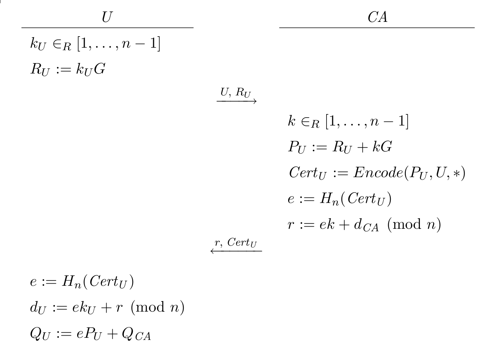

# Crypto modeling with Zenroom and Lua

The Zenroom VM uses the Lua direct-syntax parser to securely interpret
and execute operations including complex arithmetics on Elliptic Curve
primitives [ECP module](lua/modules/ECP.html) as well Pairing
operations on twisted curves (ECP2).

The resulting scripting language is a restricted Lua dialect without
any external extension, customised to resemble as much as possible the
scripting language used by cryptographers in software as for instance
Mathematica.

With Zenroom we want to lower the friction that cryptographers face
when implementing a new crypto models. One can see this software as a
sort of templating system bridging the work of cryptographers and
programmers.

The [Zencode
Whitepaper](https://files.dyne.org/zenroom/Zenroom_Whitepaper.pdf)
explains in depth the reasons and the approach taken in Zenroom.

The intended audience of this documentation chapter are cryptoraphers:
here we offer offers a brief demonstration of possibilities and
pointers to useful examples on how to implement new cryptographic
schemes.

## Short path from math to production

Examples speak more than a thousand words. We will dive into one
implementation to make it evident how easy is to go from an academic
paper offering the mathematical formulation of a cryptographic model
to a portable implementation running efficiently on any platform.

### ElGamal

As a basic introduction to this language we propose the implementation
of [ElGamal encryption
system](https://en.wikipedia.org/wiki/ElGamal_encryption) widely used
in homomorphic encryption, the code below makes use of the [ECP
arithmetics](lua/modules/ECP.html) provided by Zenroom.

```lua
ECP = require('ECP')

function ElGamal.keygen()
   local d = INT.modrand(ECP.order())
   local gamma = d * ECP.generator()
   return d, gamma
end

function ElGamal.encrypt(gamma, m, h)
   local k = INT.modrand(ECP.order())
   local a = k * ECP.generator()
   local b = 
	gamma * k
	+
	h * m
   return a, b, k
end

function ElGamal.decrypt(d, a, b)
   return b - a * d
end
```


### ECQV

For a practical example we will now use the Zenroom implementation of
the [Elliptic Curve Qu-Vanstone
(ECQV)](https://www.secg.org/sec4-1.0.pdf) scheme also known as
"[Implicit
Certificate](https://en.wikipedia.org/wiki/Implicit_certificate)" and
widely used by Blackberry technologies.

#### Mathematical Formula



#### Zenroom Implementation

```lua
ECP = require('ECP')
G = ECP.generator()
function rand() -- random modulo
	return BIG.modrand(ECP.order())
end
-- make a request for certification
ku = BIG.modrand(ECP.order())
Ru = G * ku
-- keypair for CA
dCA = BIG.modrand(ECP.order()) -- private
QCA = G * dCA       -- public (known to Alice)
-- from here the CA has received the request
k = BIG.modrand(ECP.order())
kG = G * k
-- public key reconstruction data
Pu = Ru + kG
declaration =
	{ public = Pu:octet(),
      requester = str("Alice"),
      statement = str("I am stuck in Wonderland.") }
declhash = sha256(OCTET.serialize(declaration))
hash = BIG.new(declhash, ECP.order())
-- private key reconstruction data
r = (hash * k + dCA) % ECP.order()
-- verified by the requester, receiving r,Certu
du = (r + hash * ku) % ECP.order()
Qu = Pu * hash + QCA
assert(Qu == G * du)
```

## Elliptic Curve Point arithmetics

The brief demonstration above shows how easy it can be to implement a
cryptographic scheme in Zenroom's Lua dialect, which gives immediately
the advantage of a frictionless deployement on all targets covered by
our VM.

Arithmetic operations also involving [Elliptic Curve Points
(ECP)](lua/modules/ECP.html) are applied using simple operators on
[BIG integers](lua/modules/BIG.html).

All this is possible without worrying about library dependencies, OS
versioning, interpeter availability etc.

# Basic advantages

Putting the mathematical formula and the code side by side while using
the same variable names greatly helps to review the correctness of the
implementation.

The tooling inherited from Zenroom allows to swiftly build test
coverage and benchmarks.

Future Zenroom developments will improve the provability of the
calculations and their results, as well provide testing techniques as
fuzzing: this will automatically benefit all implementations.

Cryptographers can work independently from programmers, by modeling
their formulas using their best known tools and then provide the
script as a payload to be uploaded inside the VM.

System integrators can work on [embedding Zenroom as a VM](embed)
without worring about cryptographic libraries APIs and moving
dependencies required by the cryptographic implementations.

All in all, by using Zenroom your cryptographic model implementation
is ready for an accellerating future where crypto technologies will
grow in diversity and possibilities!


