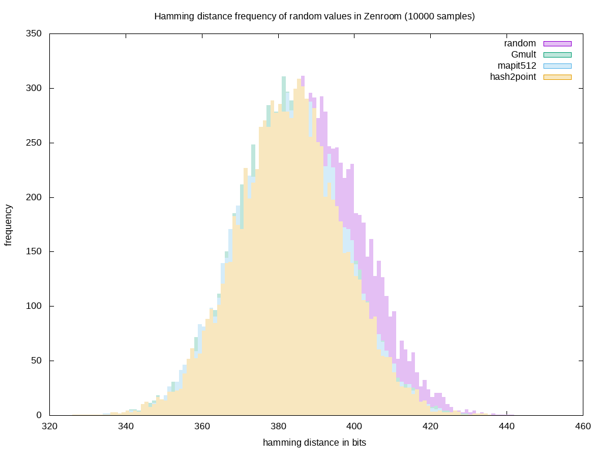

# Random quality measurements

Obviously random is very important when doing cryptography.

Zenroom accept a random seed when called or retreives one
automatically from the host system.

**Zenroom is fully deterministic**: if the same random seed is
provided then all results of trasformations will be exactly the same,
except for the sorting order of elements in its output, which must be
sorted by the caller with a constant algorithm.

If the random seed is not provided at call time then Zenroom does its
best to gather a good quality random seed from the host system. This
works well on Windows, OSX, GNU/Linux as well Android and iOS; but
beware that **when running in Javascript random is very weak**.

## Pseudo-random generator

Cryptographic strenght is added to any random seed by Zenroom's
pseudo-random generator (PRNG) which is an [old RSA
standard](ftp://ftp.rsasecurity.com/pub/pdfs/bull-1.pdf) basically
consisting of:

```txt
Unguessable seed -> SHA -> PRNG internal state -> SHA -> random numbers
```
-----
This is a rather old PRNG and will soon be substituted with [the
Fortuna PRNG](https://en.wikipedia.org/wiki/Fortuna_(PRNG)) in
forthcoming versions.

## Hamming distance frequency

As a reference indicator of results here we provide a graph that shows
the [Hamming distance](https://en.wikipedia.org/wiki/Hamming_distance)
measuring how many different bits are there between each new random
776 bit long octets. This benchmark was run on a PC gathering entropy
from system events:



Here are represented four different random generation methods which
are commonly used in cryptographic transformations. It is noticeable
that the most common average distance is **between 380 and 400 bits**
for all of them.

## Measure your system

To have a value estimation on the system you are currently running
Zenroom, run this simple lua script:

```lua
print( BENCH.random_hamming_freq() )
```

Then compare the number returned: if much lower than 350 then you
should worry about the quality of random on your current system.

